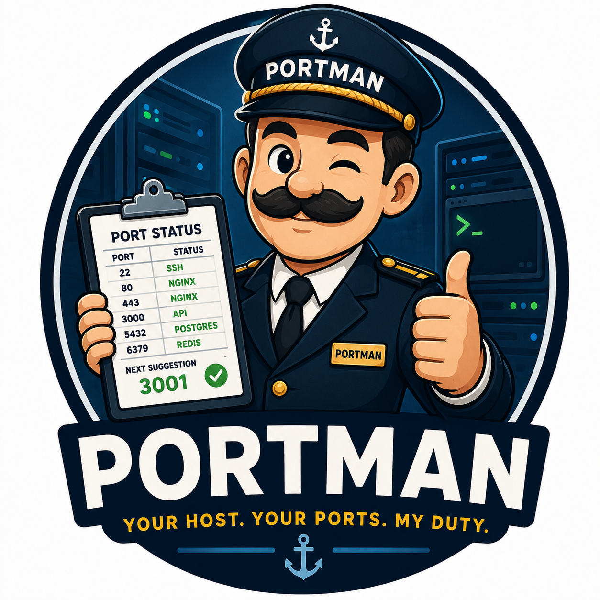

# Portman

<p align="center">
  
</p>

## Introducing Portman

Have you ever wanted to deploy an app, only to discover the port you had in mind is already taken?

You don't want to break the existing app. You just want the next available port.

Instead, you end up scrolling through `ss`, checking notes, reading old deployment docs, and wondering if port `3007` was free or already used by something important.

Why not let a tool do the work?

**Portman** discovers allocated ports, keeps track of allocations, and suggests the next best port for your new application.

Not the airport kind of Portman—the one that manages ports on your host machine so you can focus on deploying, not port hunting.

## Features

* **Identify allocated ports**: Quickly see which TCP and UDP ports are currently in use.
* **Port suggestions**: Get a safe, unused port for your next deployment within the recommended range (3000-9999).
* **Automation friendly**: Structured output that's easy to use in scripts.
* **Minimal dependencies**: Single binary deployment with no external runtime requirements.

## Installation

### Recommended: Install Script

The easiest way to install Portman on Linux or macOS:

```bash
curl -fsSL https://raw.githubusercontent.com/mhshahzad/portman/main/install.sh | bash
```

### Manual Binary Download

Download the pre-compiled binary for your platform from the [latest releases](https://github.com/mhshahzad/portman/releases/latest).

```bash
# Example for Linux amd64
curl -L https://github.com/mhshahzad/portman/releases/latest/download/portman-linux-amd64 -o portman
chmod +x portman
sudo mv portman /usr/local/bin/
```

### From Source 

Ensure you have Go 1.24+ installed.

```bash
git clone https://github.com/mhshahzad/portman.git
cd portman
go build -o portman
sudo mv portman /usr/local/bin/
```

## Usage

### See what ports are already in use

```bash
portman status
```

Example output:

```text
PORT    PROTOCOL    PROCESS    PID
22      tcp         sshd       1122
80      tcp         nginx      2000
443     tcp         nginx      2000
5432    tcp         postgres   1234
6379    tcp         redis      3456
```

Running without root privileges may hide process names and PIDs depending on your system configuration.

### Need a port for your next deployment?

Instead of manually checking every port, just ask Portman:

```bash
portman suggest
```

or

```bash
portman next
```

Example output:

```text
3001
```

Portman scans the host, identifies active ports, and returns the next available port in the recommended application range (`3000-9999`).

### Typical workflow

Deploying a new application?

```bash
portman status
```

Check what's already running.

```bash
portman suggest
```

Get the next safe port.

```bash
docker run -p 3001:8080 my-app
```

Deploy without guessing, without conflicts, and without maintaining a spreadsheet of port allocations.

## Tech Stack

* **Language**: Go 1.24+
* **CLI Framework**: Cobra
* **Backend Tools**: `ss`, `lsof`, `netstat` 

## Development Philosophy

1. CLI-first.
2. Linux & macOS support. 
3. Single binary deployment.
4. Minimal dependencies.
5. Small and understandable codebase.
6. Extensible architecture.

## License

Open Source

## Contribution

For contribution, Please see the full guide: [CONTRIBUTING.md](./CONTRIBUTING.md)